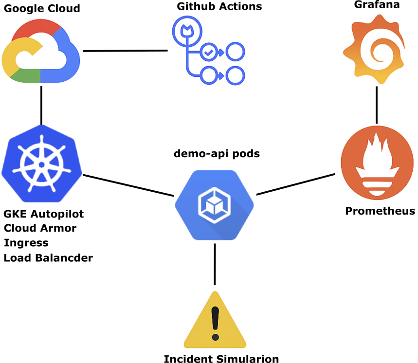
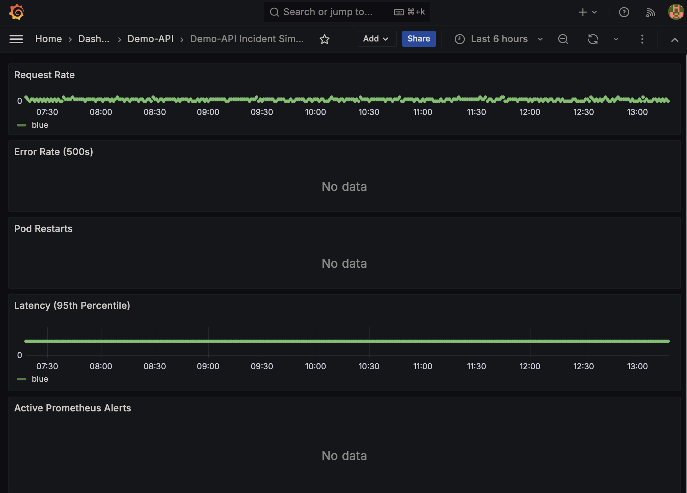

## Infra Observability Lab

A hands-on DevOps lab exploring infrastructure provisioning, observability tooling, incident simulation — built on GCP for learning and experimentation.

---

### 📘 Project Overview

This lab is designed as a **teaching artifact** for Kubernetes learners. It models real‑world observability, deployment hygiene, and security practices in a reproducible way. The project has evolved beyond a simple Prometheus/Grafana demo into a structured environment that emphasizes onboarding clarity and operational trade‑offs.

---

#### 🎯 Goals
- Provide a **kubectl‑driven lab** that learners can run locally or in GKE.
- Teach **observability fundamentals** with Prometheus and Grafana.
- Demonstrate **blue/green deployments** using demo‑api.
- Model **namespace discipline** (`observability` vs `default`) to avoid common pitfalls.
- Show **security hygiene** by keeping observability tools internal and protecting public endpoints with Cloud Armor.
- TODO

---

#### 🏗️ Architecture
- **demo‑api**: A simple application exposed via `LoadBalancer` + Ingress for blue/green switching and incident simulation.
- **Prometheus**: Internal (`ClusterIP`), accessed via port‑forwarding, scrapes demo‑api metrics.
- **Grafana**: Internal (`ClusterIP`), accessed via port‑forwarding, visualizes Prometheus data.
- **Cloud Armor**: Protects demo‑api ingress with rate limiting and IP rules.
- **Namespace separation**: All components live in `observability` to reinforce best practices.
- TODO

---

#### 🔑 Key Teaching Moments
- **Service DNS alignment**: Prometheus scrapes `demo-api.observability.svc.cluster.local`
- **Port‑forwarding vs public IPs**: Observability tools stay private; demo‑api is public.
- **Blue/green deployments**: Learners inspect Service selectors and curl responses to see which version is active.
- **Security at the edge**: Cloud Armor policies throttle abusive traffic before it reaches pods.
- **Troubleshooting flow**: Learners practice fixing namespace errors, DNS mismatches, and scrape failures.

---

### Architecture



*A GCP-hosted GKE Autopilot cluster runs Prometheus and Grafana. Metrics are collected from simulated workloads and exposed via exporters. Alerts trigger based on thresholds, and incident simulations validate recovery paths.*

---

### 🔧 Components

| Module                | Purpose                                                                 |
|-----------------------|-------------------------------------------------------------------------|
| `.github/workflows/`  | GitHub Actions pipelines for linting, testing, image build/push, and cluster deploy |
| `demo_api`            | Python code and Dockerfile for Blue, Green, and Red flask apps |
| `k8s/`                | Kubernetes manifests for workloads and observability stack (Prometheus, Grafana). Uses kustomization |
| `terraform/`          | Infrastructure-as-code to provision the GKE Autopilot cluster and base networking |
| `terraform/demo-api`  | Terraform module that deploys the demo-api workloads (blue/green/red), Services, and supporting Kubernetes resources |
| `traffic-gen`         | Lightweight Python traffic generator that sends good, error, and crash traffic patterns to the demo-api service for observability testing |
| `architecture.png`    | System diagram showing cluster flow, observability, and CI/CD integration |
| `README.md`           | Entry point documentation, reliability framing, and demo instructions |

---

### Environment Strategy

In production-grade GCP environments, it’s a best practice to use separate projects for each environment (e.g., development, staging, production). This enables:

•  Clear isolation of resources and IAM policies
•  Environment-specific billing and quotas
•  Safer CI/CD pipelines and policy enforcement

#### Lab Context

For this lab, all resources are provisioned into a single GCP project to simplify setup and reduce cost. To simulate environment separation, we apply consistent [GCP resource labels](https://cloud.google.com/resource-manager/docs/creating-managing-labels) labels applied via Terraform.

> When scaling this lab into a production-like setup, consider using one GCP project per environment and managing shared configuration via Terraform workspaces, modules, or a multi-project structure.

#### Example label schema:

| Key           | Value               | Purpose                                  |
|---------------|---------------------|------------------------------------------|
| `environment` | `development`       | Signals lifecycle stage                  |
| `purpose`     | `observability-lab` | Context for dashboards and billing       |
| `managed-by`  | `terraform`         | Shows infra-as-code ownership            |

These labels are defined in `variables.tf` and applied to all supported resources via the `resource_labels` map.

#### Example usage in Terraform:

```hcl
resource "google_container_cluster" "autopilot" {
  name     = var.cluster_name
  location = var.region
  enable_autopilot = true

  ...

  resource_labels = var.resource_labels
}
```

---

### Prerequisites

#### 🔧 Python Setup

This repo uses Python‑based tooling for linting and pre‑commit hooks. To install the required packages:

```bash
pip install -r requirements.txt
```

- This installs **yamllint**, **pre‑commit**, and any other Python dependencies listed.
- After installation, you can run:
  ```bash
  pre-commit install
  ```
  to enable hooks locally.
- Then run:
  ```bash
  pre-commit run --all-files
  ```
  to check and format everything.

---

🧭 Teaching note:
> “Adding this step ensures learners don’t hit missing‑tool errors. It makes the linting workflow reproducible and lowers setup friction.”

---

#### 🧹 Linting & Formatting

This repo enforces YAML style and formatting automatically to keep manifests consistent and easy to read.

- **Tools used**
  - [yamllint](https://yamllint.readthedocs.io/) — checks YAML syntax and style rules.
  - [Prettier](https://prettier.io/) — formats YAML consistently across editors.
  - [pre‑commit](https://pre-commit.com/) — runs both tools automatically before commits.

- **Style rules**
  - Indentation is standardized to Prettier’s defaults (sequence items indented under their parent key).
  - yamllint is configured with `indent-sequences: consistent` so it aligns with Prettier’s style.
  - Both tools agree on spacing, quoting, and line breaks, so you won’t see “tug‑of‑war” changes.

- **How to run checks**
  ```bash
  # Run linting/formatting on all files
  pre-commit run --all-files
  ```

- **Workflow**
  - On commit, pre‑commit will automatically run yamllint and Prettier.
  - If yamllint finds issues, fix them before committing.
  - If Prettier reformats files, just stage the changes and commit again.

- **Why this matters**
  - Consistent style reduces distractions for learners.
  - Prettier ensures manifests look the same across editors.
  - yamllint catches indentation or syntax errors early, before they reach `kubectl`.

---

🧭 Teaching note:
> “This section reassures learners that linting errors aren’t about validity of Kubernetes manifests, but about style consistency. It also shows them how to run and trust the tooling rather than fight it.”

---

#### Install Terraform (macOS)

```bash
brew tap hashicorp/tap
brew install hashicorp/tap/terraform
```

Verify installation:

```bash
terraform -version
```

> For other platforms, see [Terraform Downloads](https://developer.hashicorp.com/terraform/downloads)

#### Install gcloud CLI

```bash
brew install --cask google-cloud-sdk
```

Authenticate and set your project:

```bash
gcloud auth login
gcloud config set project infra-observability-lab
gcloud services enable container.googleapis.com
```

#### Install kustomize library
 Kustomize is a configuration management tool built into kubectl (and also available as a standalone CLI).

 It lets you customize Kubernetes YAML manifests without templates. Instead of writing Helm‑style templating, you define base manifests and then apply overlays (patches, generators, substitutions).

 It’s part of the Kubernetes ecosystem and maintained under the kubernetes-sigs project.


```bash
brew install kustomize
```

#### Remote State with GCS

To enable shared, auditable infrastructure state, this lab uses Terraform remote state stored in a GCS bucket.

```bash
gsutil mb -p infra-observability-lab -l us-central1 gs://infra-observability-tfstate/
```

Then add backend.tf in the terraform/ directory:

```Hcl
terraform {
  backend "gcs" {
    bucket  = "infra-observability-tfstate"
    prefix  = "terraform/state"
  }
}
```

#### Service Account for Terraform

To isolate provisioning from personal credentials and prepare for CI/CD, create a dedicated service account:

```bash
gcloud iam service-accounts create terraform \
  --display-name "Terraform Provisioner"

gcloud projects add-iam-policy-binding infra-observability-lab \
  --member="serviceAccount:terraform@infra-observability-lab.iam.gserviceaccount.com" \
  --role="roles/editor"

gcloud iam service-accounts keys create key.json \
  --iam-account=terraform@infra-observability-lab.iam.gserviceaccount.com
```

> Move `key.json` outside the repository, such as `~/.gcp/`, so it is not commited


#### Setting up `GCP_TF_KEY` for GitHub Actions

To allow Terraform to authenticate with Google Cloud during CI/CD runs, you’ll need to provide a service account key as a GitHub secret.

1. Create a Service Account in GCP

•  Go to IAM & Admin → Service Accounts in the GCP Console.
•  Create a new service account (e.g., terraform-ci).
•  Assign it the necessary roles (e.g., roles/editor or more restricted roles like roles/storage.admin depending on your use case).
•  Generate a JSON key and download it.

2. Add the Key to GitHub Secrets

•  Open your GitHub repo → Settings → Secrets and variables → Actions → New repository secret.
•  Name the secret: GCP_TF_KEY.
•  Paste the entire JSON key file contents into the value field.

> On macOS you can copy the file contents with pbcopy < ~/.gcp/key.json and paste directly.

---

### Usage: Terraform Workflow

This lab provisions infrastructure on Google Cloud using Terraform. The typical workflow is:

#### 1. Initialize Terraform
Run once per new environment or after adding providers/modules:

```bash
terraform init
```

- Downloads the required provider plugins (e.g., `google`).
- Sets up the backend for state storage.
- Prepares the working directory for use.

---

#### 2. Preview Changes (Plan)
Generate an execution plan to see what Terraform will do:

```bash
terraform plan
```

- Shows resources to be created, updated, or destroyed.
- Safe to run multiple times.
- Use this step in CI/CD workflows for review before apply.

---

#### 3. Apply Changes
Provision the resources in GCP:

```bash
terraform apply
```

- Executes the plan and creates the infrastructure.
- Prompts for confirmation unless `-auto-approve` is used.
- Example: creates the GKE cluster defined in your configuration.

---

#### 4. Connect to the Cluster
Once the cluster is provisioned, configure `kubectl` to talk to it:

```bash
gcloud container clusters get-credentials observability-lab --region us-central1
```

- Updates your local `~/.kube/config` with cluster credentials.
- Sets the current context to the new cluster.

Verify connectivity:

```bash
kubectl get nodes
kubectl get pods --all-namespaces
```

#### Workflow Hygiene
- Always run `plan` before `apply` to review changes.
- Use GitHub Actions workflows to automate `plan` (PR) and `apply` (merge).
- Document incidents and recovery steps in the README for reproducibility.

---

### Post‑Apply Cluster Setup

After provisioning the GKE cluster with Terraform, you may see warnings in the Cloud Console:

#### ⚠️ Verify Webhook Endpoints
- **Meaning**: Admission webhooks (used for policy enforcement or mutating workloads) must be reachable and healthy.
- **Action**:
  - If you haven’t deployed custom webhooks, you can ignore this for now.
  - If you add webhooks later, confirm they’re accessible from the cluster and don’t block pod scheduling (`kubectl describe pod` will show webhook errors).


#### ⚠️ Set Maintenance Window
- **Meaning**: GKE automatically upgrades control plane and nodes. By default, upgrades can occur at any time.
- **Action**:
  - In the Cloud Console, go to **Cluster details → Maintenance window**.
  - Set a preferred time (e.g., 2–4 AM local) when upgrades are least disruptive.
  - This is optional in a lab, but demonstrates proactive ops hygiene.

---

#### ⚠️ Common Setup Errors
- **403: Kubernetes Engine API not enabled**
  Enable it before running `apply`:
  ```bash
  gcloud services enable container.googleapis.com
  ```
- **Pods stuck in `Pending`**
  - Cluster may still be initializing — wait a few minutes.
  - Check pod events with `kubectl describe pod <name>`.
  - Ensure resource requests/limits are compatible with Autopilot.

---

### 🚀 GitHub Actions + Google Cloud Workload Identity Federation (WIF)

This repository uses **GitHub Actions** to run Terraform against Google Cloud.
Authentication is handled via **Workload Identity Federation (WIF)**, which allows GitHub’s OIDC tokens to be exchanged for short‑lived Google Cloud credentials — eliminating the need for long‑lived JSON keys.

#### 🔧 How it works
1. GitHub Actions jobs request an **OIDC token** from GitHub.
2. Google Cloud’s **Workload Identity Pool Provider** validates the token (issuer, audience, repo, branch).
3. The provider allows impersonation of a **service account** (e.g. `terraform-sa@PROJECT_ID.iam.gserviceaccount.com`).
4. Terraform uses that service account to access GCP resources securely.

#### ⭐ Why Workload Identity Federation?

Traditional CI pipelines authenticate to GCP using a downloaded JSON key stored in GitHub Secrets. That approach works, but it has drawbacks:

- JSON keys never expire
- Keys can be leaked or copied
- Rotating keys is manual and error‑prone

WIF solves all of this by letting GitHub exchange its OIDC token for a short‑lived Google Cloud access token, with no secrets stored in the repo.

---

#### ✅ Steps to enable WIF on GCP

1. **Enable required APIs**
   ```bash
   gcloud services enable iam.googleapis.com \
       cloudresourcemanager.googleapis.com \
       sts.googleapis.com
   ```
   (Add `container.googleapis.com`, `storage.googleapis.com`, etc. if Terraform manages GKE or GCS.)

2. **Create a Workload Identity Pool**
   ```bash
   gcloud iam workload-identity-pools create github-pool \
     --project=$PROJECT_ID \
     --location=global \
     --display-name="GitHub Pool"
   ```

3. **Create a Provider for GitHub OIDC**
   ```bash
   gcloud iam workload-identity-pools providers create-oidc github-provider \
     --project=$PROJECT_ID \
     --location=global \
     --workload-identity-pool=github-pool \
     --display-name="GitHub Provider" \
     --issuer-uri="https://token.actions.githubusercontent.com" \
     --attribute-condition="attribute.repository=='YOUR_ORG/YOUR_REPO' && attribute.ref=='refs/heads/main'" \
     --attribute-mapping="google.subject=assertion.sub,attribute.actor=assertion.actor,attribute.repository=assertion.repository,attribute.ref=assertion.ref" \
     --allowed-audiences="https://github.com/"
   ```

4. **Create a Service Account**
   ```bash
   gcloud iam service-accounts create terraform-sa \
     --project=$PROJECT_ID \
     --display-name="Terraform Service Account"
   ```

5. **Grant IAM roles to the Service Account**
   - Example roles:
     - `roles/storage.objectAdmin` (for GCS state bucket)
     - `roles/container.admin` (for GKE clusters)
     - `roles/iam.workloadIdentityUser` (to allow WIF impersonation)
   ```bash
   gcloud projects add-iam-policy-binding $PROJECT_ID \
     --member="serviceAccount:terraform-sa@$PROJECT_ID.iam.gserviceaccount.com" \
     --role="roles/iam.workloadIdentityUser"
   ```

6. **Update GitHub Actions workflow**
   ```yaml
   permissions:
     id-token: write
     contents: read

   - name: Authenticate to Google Cloud
     uses: google-github-actions/auth@v2
     with:
       workload_identity_provider: projects/PROJECT_NUMBER/locations/global/workloadIdentityPools/github-pool/providers/github-provider
       service_account: terraform-sa@PROJECT_ID.iam.gserviceaccount.com
       audience: https://github.com/
   ```

---

#### 🧭 Notes
- Replace `PROJECT_ID` and `PROJECT_NUMBER` with your actual values.
- The `attributeCondition` ensures only tokens from your repo/branch can impersonate the service account.
- No JSON keys are stored in GitHub — authentication is fully keyless and short‑lived.

---

#### 🛠️ Troubleshooting GitHub Actions + GCP WIF

Even with Workload Identity Federation configured, you may encounter errors during `terraform plan` or `apply`. Below are the most common issues and their resolutions.

##### 1. **403: Permission denied to list services**
```
Error: Failed to list enabled services for project ...
```
**Cause:** The service account lacks Service Usage roles.
**Fix:** Grant `roles/serviceusage.serviceUsageConsumer` (read) and optionally `roles/serviceusage.serviceUsageAdmin` (enable/disable APIs).

---

##### 2. **403: Required `container.clusters.get` permission**
```
Error: Required "container.clusters.get" permission(s) ...
```
**Cause:** Missing GKE/Compute permissions.
**Fix:** Grant `roles/container.admin` and `roles/compute.viewer` to the service account.

---

##### 3. **403: Permission `iam.workloadIdentityPools.get` denied**
```
Error: Permission 'iam.workloadIdentityPools.get' denied ...
```
**Cause:** Service account cannot manage Workload Identity Pools.
**Fix:** Grant `roles/iam.workloadIdentityPoolAdmin`.

---

##### 4. **Cloud Resource Manager API disabled**
```
Error: Cloud Resource Manager API has not been used in project ...
```
**Cause:** Required APIs not enabled.
**Fix:** Enable APIs:
```bash
gcloud services enable cloudresourcemanager.googleapis.com iam.googleapis.com sts.googleapis.com
```

---

##### 5. **Variables not allowed in `terraform.tfvars`**
```
Error: Variables may not be used here ...
```
**Cause:** CI mangled the `tfvars` file when writing from secrets.
**Fix:** Use a heredoc in your workflow:
```yaml
- name: Write tfvars
  working-directory: terraform
  run: |
    cat <<'EOF' > terraform.tfvars
    ${{ secrets.TFVARS }}
    EOF
```

---

##### 6. **403 on GCS bucket access**
```
Error: terraform-sa does not have storage.objects.list access ...
```
**Cause:** Service account lacks bucket permissions.
**Fix:** Grant `roles/storage.objectAdmin` on the state bucket.

---

#### 🧭 Notes
- IAM changes can take a few minutes to propagate.
- Always confirm your `workload_identity_provider` string matches the exact GCP resource name.
- Use `audience: https://github.com/` in your workflow to match GitHub’s OIDC token.

---

---

### 📦 demo-api

`demo-api` is a lightweight demo service used to illustrate blue/green deployments, observability, and incident simulation. It exposes a simple HTTP endpoint that responds with a version string, making it easy to visualize traffic shifts in Prometheus and Grafana.

#### 🔍 Features
- Minimal Flask/Express-style API returning `Hello from demo-api <VERSION>!`
- Configurable via environment variable `VERSION` (e.g., `v1`, `v2`)
- Exposes `/metrics` endpoint for Prometheus scraping
- Designed for teaching reproducible Kubernetes workflows

#### 🚀 Usage (Docker)
You don’t need to build the image yourself — just pull from Docker Hub:

```bash
docker run -p 5000:5000 \
  -e VERSION=v1 \
  dannyanko/infra-demo-api:latest
```

Visit [http://localhost:5000](http://localhost:5000) → returns:
```
Hello from demo-api v1!
```

#### 📄 Kubernetes Deployment
Reference the public image in your manifests:

```yaml
containers:
- name: infra-demo-api
  image: dannyanko/infra-demo-api:v1
  ports:
  - containerPort: 5000
  env:
  - name: VERSION
    value: "blue"   # or "green"
```

#### 🧭 Best Practices
- **Never rely on `:latest`** in production. It’s mutable and prone to caching issues.
- **Always use versioned tags** (`:v1`, `:v2`, etc.) for reproducibility.
- Document image versions in your repo so learners know which tag to deploy.
- CI/CD pipelines should automatically bump tags and roll out new versions.

Here’s a complete **README section in Markdown** you can drop into your repo to cover the **Blue/Green Deployment demo**. It walks learners through the Dockerfile, multi‑platform builds, pushing to Docker Hub, deploying with `kubectl`, and finally switching traffic and testing requests.

---

### 🔵🟢🔴 Blue/Green/Red Deployment Demo (Terraform + GitHub Actions)
This section demonstrates how the demo_api service is built, versioned, and deployed into Kubernetes using Terraform and GitHub Actions. Three parallel versions of the service — blue, green, and red — run side‑by‑side in the cluster.
• Blue and green behave normally
• Red intentionally introduces errors and latency for observability and incident‑response practice

All deployments are fully automated through CI/CD.

#### 🐳 Container Image (Python/Flask)
The demo_api service is a lightweight Python/Flask API. Its Dockerfile lives in the demo_api/ directory and is built automatically by GitHub Actions using Docker Buildx.
You no longer need to build images manually — the workflow handles:
• Multi‑arch builds (amd64 + arm64)
• Tagging (v<run_number> + latest)
• Pushing to Docker Hub

### 🚀 Automated CI/CD Pipeline
The deploy.yaml GitHub Actions workflow performs the full build‑and‑deploy sequence whenever Python files inside demo_api/ change and are merged into main.

1. Tests run
The workflow installs dependencies and runs pytest.
If tests fail, deployment stops.

2. Multi‑arch Docker image is built and pushed
Buildx produces a manifest list and pushes:
• dannyanko/demo-api:v<run_number>
• dannyanko/demo-api:latest
Every deployment uses a unique, traceable version.

3. Terraform deploys the new version
Terraform receives the new image tag via variables:

```
terraform apply -auto-approve \
  -var="demo_api_image_blue=dannyanko/demo-api:v123" \
  -var="demo_api_image_green=dannyanko/demo-api:v123" \
  -var="demo_api_image_red=dannyanko/demo-api:v123"
```

Terraform updates all three Kubernetes Deployments (blue, green, red) to use the new image.

4. GKE Autopilot performs rolling updates
Kubernetes automatically:
• Pulls the new image
• Replaces old Pods
• Ensures zero downtime

No manual `kubectl` apply is required.

#### 🧱 Terraform‑Managed Deployments

Terraform owns the Kubernetes manifests for all three versions.
Each Deployment is parameterized by the image version passed in from CI/CD.

Example (simplified):

```Hcl
variable "demo_api_image_blue" {}
variable "demo_api_image_green" {}
variable "demo_api_image_red" {}

resource "kubernetes_deployment" "demo_api_blue" {
  metadata {
    name      = "demo-api-blue"
    namespace = "observability"
    labels = {
      app     = "demo-api"
      version = "blue"
    }
  }

  spec {
    replicas = 2
    selector {
      match_labels = {
        app     = "demo-api"
        version = "blue"
      }
    }

    template {
      metadata {
        labels = {
          app     = "demo-api"
          version = "blue"
        }
      }

      spec {
        container {
          name  = "demo-api"
          image = var.demo_api_image_blue
          port {
            container_port = 5000
          }
        }
      }
    }
  }
}
```

Terraform generates equivalent resources for green and red.

#### 🔀 Switching Traffic Between Blue/Green/Red
Traffic routing is controlled by a single Kubernetes Service, also managed by Terraform.

To switch traffic, update the selector:
```Hcl
selector = {
  app     = "demo-api"
  version = "blue"   # change to "green" or "red"
}
```

Apply via CI/CD or run terraform apply manually if you’re experimenting locally.

#### 🌐 Accessing the Service
Terraform also manages the LoadBalancer Service or Ingress (depending on your configuration).

Once applied, retrieve the external IP:
```kubectl get svc demo-api -n observability```

Then send requests:
```curl http://<external-ip>/```

If the Service selects version=blue, responses come from the blue Pods
If it selects version=green, responses come from green
If it selects version=red, you’ll see error/latency behavior for incident simulation

#### 🎉 Key Takeaways
• Terraform is the single source of truth for all Kubernetes resources
• GitHub Actions builds and deploys new versions automatically
• Blue/Green/Red run in parallel for safe testing and observability practice
• Traffic switching is done by updating the Service selector in Terraform
• Red provides controlled failure modes for hands‑on incident response training

---

### 📦 Kustomization

We organize manifests into component directories (`demo-api/`, `prometheus/`, `grafana/`) and aggregate them at the **top‑level `kustomization.yaml`**. Each directory has its own `kustomization.yaml` so components remain modular and reproducible.

---

#### 🗂️ ConfigMaps

We use ConfigMaps for **global values**, **Prometheus templates**, and **Grafana dashboards**:

- **Global Config** (`global-config`):
  - Holds literals like `PROMETHEUS_TARGET` and `DEMO_API_SELECTOR`.
  - These values are patched into Service selectors and Prometheus scrape configs using `replacements`.

- **Prometheus Config Template**:
  - Generated from `prometheus/prometheus.yml.template` using `configMapGenerator`.
  - The template contains `${PROMETHEUS_TARGET}` placeholders.
  - An initContainer runs `envsubst` to expand those placeholders into a real `prometheus.yml` before Prometheus starts.

- **Grafana Dashboards**:
  - Dashboards are stored as JSON files (`dashboard.json`) and turned into ConfigMaps with `configMapGenerator`.
  - Grafana’s sidecar loader imports any ConfigMap labeled `grafana_dashboard=1`.

Teaching note:
> ConfigMaps are for non‑sensitive configuration. We keep them versioned in Git so learners can see exactly how values flow into workloads. Prometheus uses a template + initContainer to demonstrate preprocessing.

---

#### 📂 Directory Layout
```
k8s/
├── kustomization.yaml        # top-level
├── prometheus/
│   ├── kustomization.yaml
│   └── prometheus.yml.template
└── grafana/
    └── kustomization.yaml
```

---

#### 🔹 prometheus.yml.template
```yaml
global:
  scrape_interval: 15s

scrape_configs:
  - job_name: 'demo-api'
    metrics_path: /metrics
    static_configs:
      - targets: ["${PROMETHEUS_TARGET}"]
```

Notice the `${PROMETHEUS_TARGET}` placeholder — the initContainer expands this into a real hostname:port string at runtime.

---

#### 🔹 k8s/prometheus/kustomization.yaml
```yaml
apiVersion: kustomize.config.k8s.io/v1beta1
kind: Kustomization

resources:
  - deployment.yaml
  - service.yaml

configMapGenerator:
  - name: prometheus-config-template
    files:
      - prometheus.yml.template=prometheus.yml.template

generatorOptions:
  disableNameSuffixHash: true
```

This generates a ConfigMap with the template file. The initContainer consumes it and writes the expanded config into a shared `emptyDir` volume.

---

#### 🔹 k8s/kustomization.yaml (top-level)
```yaml
apiVersion: kustomize.config.k8s.io/v1beta1
kind: Kustomization

resources:
- demo-api/
- prometheus/
- grafana/

namespace: observability

configMapGenerator:
- name: global-config
  literals:
    - PROMETHEUS_TARGET=demo-api.observability.svc.cluster.local:80
    - DEMO_API_SELECTOR=blue

secretGenerator:
- name: global-secret
  envs:
    - secret.env

generatorOptions:
  disableNameSuffixHash: true

replacements:
- source:
    kind: ConfigMap
    name: global-config
    fieldPath: data.DEMO_API_SELECTOR
  targets:
    - select:
        kind: Service
        name: demo-api
      fieldPaths:
        - spec.selector.version
```

---

#### 🔹 What Happens
- The `prometheus-config-template` ConfigMap holds the scrape config with `${PROMETHEUS_TARGET}`.
- The Prometheus Deployment’s initContainer runs `envsubst`, expanding `${PROMETHEUS_TARGET}` into a concrete hostname:port.
- The rendered file is written into a shared `emptyDir` volume, which the Prometheus container mounts at `/etc/prometheus`.
- Prometheus starts cleanly and scrapes the correct target.

---

#### 🧭 Teaching Note
For learners:
> “Prometheus does not expand environment variables in its config. We use an initContainer with `envsubst` to preprocess the template. This models a reproducible pattern for dynamic configs.”

---

#### 🔑 Secrets

We use `secretGenerator` to manage sensitive values:

```yaml
secretGenerator:
  - name: global-secret
    envs:
      - grafana/secret.env
```

- **`secret.env`** is `.gitignored` so sensitive values never enter version control.
- Kustomize generates a Kubernetes Secret from this file at build time.
- Grafana and other components mount these secrets as environment variables.

Teaching note:
> Secrets are generated from local files, not literals in Git. This models best practice: keep sensitive values out of source control but still reproducible in teaching labs.

---

#### 🚀 Workflow

1. Edit component manifests in their directories.
2. Update global values in the top‑level `kustomization.yaml`.
3. Run:
   ```bash
   kubectl apply -k k8s/
   ```
   This applies all resources, ConfigMaps, and Secrets in one shot.
4. Restart Deployments when ConfigMaps or Secrets change:
   ```bash
   kubectl rollout restart deployment prometheus -n observability
   ```

---

#### 🧭 Summary for Learners

- **Kustomize**: Manages composition and substitutions across components.
- **ConfigMaps**: Store non‑sensitive configuration (targets, selectors, dashboards). Prometheus uses a template + initContainer for expansion.
- **Secrets**: Store sensitive values, generated from `.env` files.
- **Top‑Level Control**: All substitutions and generators live in the root `kustomization.yaml` for clarity and reproducibility.

---

### Prometheus

Prometheus requires scrape targets to be defined. To keep the repo safe and flexible, we use a **template ConfigMap** (`prometheus.yml.template`) with an environment variable placeholder. An initContainer expands it into a real config before Prometheus starts.

#### PersistentVolumeClaim PVC
Prometheus always writes data to /prometheus. Without a PVC, that’s ephemeral. Mounting a PVC makes the TSDB persistent, so metrics survive pod restarts and rescheduling.

```yaml
apiVersion: v1
kind: PersistentVolumeClaim
metadata:
  name: prometheus-data
  namespace: observability
spec:
  accessModes:
    - ReadWriteOnce
  resources:
    requests:
      storage: 10Gi   # adjust size as needed
  storageClassName: standard  # or your cluster’s default storage class
```

- ReadWriteOnce is fine for a single Prometheus pod.
- storageClassName should match your cluster’s default (often standard on GKE, gp2 on EKS, etc.).

#### Patch Prometheus Deployment

In Prometheus Deployment (k8s/prometheus/deployment.yaml), add:

```yaml
volumeMounts:
  - name: prometheus-storage
    mountPath: /prometheus

volumes:
  - name: prometheus-storage
    persistentVolumeClaim:
      claimName: prometheus-data
```

---

#### 🔹 Optional: PV reclaim policy
By default, dynamically provisioned PVs use `Delete`. If you want to **guarantee the disk isn’t recycled**, you can patch the PV after it’s created:

```bash
kubectl patch pv <pv-name> -p '{"spec":{"persistentVolumeReclaimPolicy":"Retain"}}'
```

> This ensures the underlying GCE disk survives even if the PVC is deleted.

---

> Prometheus runs as a non‑root user (UID 65534). PVCs default to root ownership, so you must fix permissions. Aligning the PVC with Prometheus’s UID/GID is safe and standard practice.

```yaml
      initContainers:
      - name: init-prometheus-data
        image: busybox
        resources:
          requests:
            cpu: "50m"
            memory: "64Mi"
          limits:
            cpu: "100m"
            memory: "128Mi"
        command: ["sh", "-c", "mkdir -p /prometheus/data && chown -R 65534:65534 /prometheus"]
        volumeMounts:
          - name: prometheus-storage
            mountPath: /prometheus
```
---

#### 📦 `prometheus-rules.yaml`

> Alerting rules tuned for `demo-api` simulation, includes both a **high error rate alert** and a **crash detection alert** based on container restarts.

```yaml
groups:
  - name: demo-api.rules
    interval: 30s
    rules:
      - alert: HighErrorRate
        expr: rate(http_requests_total{status="500"}[1m]) > 5
        for: 1m
        labels:
          severity: page
          team: observability
        annotations:
          summary: "High error rate detected in demo-api"
          description: "More than 5 HTTP 500 errors per second for 1 minute. Investigate active version and traffic pattern."

      - alert: CrashLoopDetected
        expr: increase(kube_pod_container_status_restarts_total{pod=~"demo-api-.*"}[5m]) > 3
        for: 1m
        labels:
          severity: page
          team: platform
        annotations:
          summary: "Crash loop detected in demo-api pod"
          description: "Container restarted more than 3 times in 5 minutes. Check logs, resource limits, and traffic generator behavior."
```

---

#### 🔍 Alert Logic Breakdown

| Alert Name         | Trigger Expression                                                                 | Purpose |
|--------------------|-------------------------------------------------------------------------------------|---------|
| `HighErrorRate`    | `rate(http_requests_total{status="500"}[1m]) > 5`                                   | Detects backend errors under load |
| `CrashLoopDetected`| `increase(kube_pod_container_status_restarts_total{pod=~"demo-api-.*"}[5m]) > 3`   | Detects unstable pods restarting repeatedly |

---

#### 🧭 Teaching note for learners
> “Prometheus alerts help detect incidents early. This lab models both backend errors and crash loops, so learners can practice triage and recovery using real metrics.”

---

### Prometheus Pod Discovery Fix for `demo-api`

#### ✅ Summary of Changes

##### 1. **Prometheus Configuration**
- Enabled dynamic Pod discovery via `kubernetes_sd_configs`:
  ```yaml
  scrape_configs:
    - job_name: demo-api
      kubernetes_sd_configs:
        - role: pod
      relabel_configs:
        - source_labels: [__meta_kubernetes_pod_label_app]
          action: keep
          regex: demo-api
        - source_labels: [__meta_kubernetes_pod_label_version]
          target_label: version
        - source_labels: [__meta_kubernetes_pod_container_port_name]
          action: keep
          regex: metrics
  ```
- Removed static scrape target `${PROMETHEUS_TARGET}` to rely fully on dynamic discovery.

---

##### 2. **Terraform Deployment Updates**
- Added `name = "metrics"` to the container port block in all `demo-api` Deployments:
  ```hcl
  port {
    name           = "metrics"
    container_port = var.container_port
  }
  ```
- This ensures Prometheus matches the relabel rule filtering for ports named `metrics`.

---

##### 3. **RBAC Fix**
- Verified Prometheus uses the correct ServiceAccount (`prometheus-server`) via:
  ```yaml
  serviceAccountName: prometheus-server
  ```
- Created missing ServiceAccount in the `observability` namespace:
  ```yaml
  apiVersion: v1
  kind: ServiceAccount
  metadata:
    name: prometheus-server
    namespace: observability
  ```
- Confirmed ClusterRoleBinding ties `prometheus-server` ServiceAccount to the `prometheus-server` ClusterRole with `get/list/watch` permissions on Pods.

---

#### 🔍 Verification Steps

- Prometheus UI → *Status → Targets* now shows all `demo-api` Pods as `UP`, with correct `version` labels.
- Grafana dashboards using:
  ```promql
  sum by (version) (process_resident_memory_bytes{job="demo-api"})
  ```
  now show distinct memory usage lines for blue/green/red.

---

#### 🧭 Teaching Note

> “Prometheus service discovery depends on Kubernetes metadata and RBAC. Port naming and relabeling must align, and the ServiceAccount must be authorized to list Pods.”

---

### Grafana

Grafana requires an admin password. For security, we don’t commit real secrets into Git. Instead, we use `secretGenerator` with a `.gitignored` `secret.env` file. Grafana mounts the generated Secret as environment variables.

#### Grafana Datasources

Provisioning datasources with a fixed UID e.g. `prometheus` makes dashboards reproducible. Grafana loads them at startup, so dashboards always point to the right datasource without manual wiring.”

**`k8s/grafana/prometheus.yaml`**
```yaml
apiVersion: 1
datasources:
  - name: Prometheus
    type: prometheus
    access: proxy
    url: http://prometheus:9090
    isDefault: true
    uid: prometheus  # 👈 important
```

Each panel in `demo-api-dashboard.json` should reference this datasource:

```yaml
"datasource": {
  "type": "prometheus",
  "uid": "prometheus"
}
```

---

#### 🔐 Debugging Kubernetes Secrets

Secrets are critical for storing credentials (like Grafana’s admin password). If they’re mis‑applied or left empty, pods may fail to start correctly or you won’t be able to log in. Here’s how to debug and fix them.

##### 1. Inspect the Secret

Check if the secret exists and what keys it contains:
```bash
kubectl get secret grafana-admin-secret -n observability
kubectl describe secret grafana-admin-secret -n observability
```

Decode a specific key:
```bash
kubectl get secret grafana-admin-secret -n observability \
  -o jsonpath="{.data.GF_SECURITY_ADMIN_PASSWORD}" | base64 --decode
```

- If you see nothing or `${PLACEHOLDER}`, the secret wasn’t populated correctly.
- If you see your expected password, the secret is valid.

---

##### 2. Common Issues
- **Empty values (0 bytes):** Usually caused by skipping `envsubst` when applying manifests with placeholders.
- **Wrong key names:** Grafana expects `GF_SECURITY_ADMIN_PASSWORD`.
- **Pod not restarted:** Even after fixing the secret, the Grafana pod may still be using the old value.

---

##### 3. Fixing a Broken Secret
Delete the bad secret:
```bash
kubectl delete secret grafana-admin-secret -n observability
```

Re‑create with real value:
```bash
kubectl create secret generic grafana-admin-secret \
  --from-literal=GF_SECURITY_ADMIN_PASSWORD=changeme \
  -n observability
```

Verify you have a value:
```bash
kubectl describe secret grafana-admin-secret -n observability
```

Restart Grafana pod so it picks up the new secret:
```bash
kubectl delete pod -l app=grafana -n observability
```

---

##### 4. Best Practices
- Always run manifests with placeholders through `envsubst`:
  ```bash
  export GRAFANA_PASSWORD=changeme
  envsubst < k8s/grafana/grafana-secret.yaml | kubectl apply -f -
  ```
- Document expected secret keys in your repo.
- Verify secrets before trying to log in.

---

### 📊 Accessing Prometheus and Grafana

Prometheus and Grafana are **internal observability tools**. In this lab, we intentionally keep them private inside the cluster and require port‑forwarding to access them. This models production hygiene: observability stacks are not exposed publicly, while demo applications may be.

---

#### 🔍 Check Service Types

Run:
```bash
kubectl get svc -n observability
```

Expected output:
```
NAME         TYPE         CLUSTER-IP     EXTERNAL-IP     PORT(S)    AGE
prometheus   ClusterIP    10.0.0.123     <none>          9090/TCP   2m
grafana      ClusterIP    10.0.0.124     <none>          3000/TCP   2m
demo-api     LoadBalancer 10.0.0.125     34.x.x.x        80/TCP     2m
```

- **Prometheus** → `ClusterIP` (internal only)
- **Grafana** → `ClusterIP` (internal only)
- **demo-api** → `LoadBalancer` (public IP for blue/green demo)

If Prometheus or Grafana show `LoadBalancer` with an external IP, edit their Service manifests to use `ClusterIP`.

---

#### 🔑 Port‑Forwarding Prometheus

Forward port 9090 locally:
```bash
kubectl port-forward svc/prometheus 9090:9090 -n observability
```

Open [http://localhost:9090](http://localhost:9090) in your browser.

- Go to **Status → Targets** to confirm demo‑api endpoints are `UP`.
- Run a simple query like `up` to verify metrics are being scraped.

---

#### 🔑 Port‑Forwarding Grafana

Forward port 3000 locally:
```bash
kubectl port-forward svc/grafana 3000:3000 -n observability
```

Open [http://localhost:3000](http://localhost:3000).

- Default login: `admin / admin` (unless overridden).
- Go to **Configuration → Data Sources** and confirm Prometheus is connected.
- Import a sample dashboard to visualize metrics.

---

#### 🧭 Best Practice

- **Prometheus & Grafana**: keep internal (`ClusterIP`) and require port‑forwarding.
- **demo-api**: expose via `LoadBalancer` so learners can hit a public IP and see blue/green switching.
- This separation models real‑world hygiene: observability tools are private, demo apps are public.

---

### 🛡️ Security in GCP/Kubernetes: Setting up Cloud Armor Policies

This section demonstrates how to protect your demo‑api service against DoS/DDoS and abusive traffic using **Google Cloud Armor**. Cloud Armor integrates with GKE Ingress to enforce security rules at the edge, before traffic reaches your cluster.

---

#### 1. Create a Cloud Armor Security Policy
```bash
gcloud compute security-policies create demo-api-policy \
  --description="Protect demo-api ingress with rate limiting and IP rules"
```

---

#### 2. Add a Rate Limiting Rule
For example, limit each client IP to **10 requests per second** with a burst of 20:

```bash
gcloud compute security-policies rules create 100 \
  --security-policy=demo-api-policy \
  --expression="true" \
  --action=rate-based-ban \
  --rate-limit-threshold-count=10 \
  --rate-limit-threshold-interval-sec=60 \
  --enforce-on-key=IP \
  --ban-duration-sec=60 \
  --conform-action=allow \
  --exceed-action="deny-429" \
  --description="Rate limit: 10 RPS per IP, ban for 60s if exceeded"
```

- `--rate-limit-threshold-count=10` → max 10 requests
- `--rate-limit-threshold-interval-sec=60` →  seconds
- `--enforce-on-key=IP` → enforce per client IP
- `--ban-duration-sec=60` → ban for 60 seconds if exceeded
- `--conform-action=allow` → requests under the threshold are allowed.
- `--exceed-action="deny-429"` → requests over the threshold get HTTP 429 Too Many Requests.
- `--action=rate-based-ban` + `--ban-duration-sec=60` → if a client repeatedly exceeds the threshold, they’re banned for 60 seconds.

---

#### 3. Define a BackendConfig in Kubernetes
```yaml
apiVersion: cloud.google.com/v1
kind: BackendConfig
metadata:
  name: demo-api-backendconfig
  namespace: observability
spec:
  securityPolicy:
    name: demo-api-policy   # 👈 must match Cloud Armor policy name
```

Apply:
```bash
kubectl apply -f backendconfig.yaml -n observability
```

---

#### 4. Annotate the Service
```yaml
apiVersion: v1
kind: Service
metadata:
  name: demo-api
  namespace: observability
  annotations:
    cloud.google.com/backend-config: '{"default": "demo-api-backendconfig"}'
spec:
  type: NodePort
  selector:
    app: demo-api
  ports:
    - port: 80
      targetPort: 3000
```

Apply it:

```bash
kubectl apply -f demo-api/service.yaml
```

---

#### 5. Create the Ingress
```yaml
apiVersion: networking.k8s.io/v1
kind: Ingress
metadata:
  name: demo-api-ingress
  namespace: observability
  annotations:
    kubernetes.io/ingress.class: "gce"   # Use GCE ingress controller
spec:
  rules:
  - http:
      paths:
      - path: /
        pathType: Prefix
        backend:
          service:
            name: demo-api
            port:
              number: 80
```

Apply it:

```bash
kubectl apply -f ingress.yaml
```

---

#### 6. Verify Policy Attachment
Get list of backend services

```bash
gcloud compute backend-services list
```

Get details of the service

```bash
gcloud compute backend-services describe ks-be<hash> \
  --global \
  --format="value(securityPolicy)"
```

You should see `demo-api-policy`.

---

#### 🎉 Key Takeaways
- Cloud Armor policies are created in GCP and bound to GKE backends via `BackendConfig`.
- Rate limiting rules throttle abusive clients before traffic reaches your pods.
- This setup models production hygiene: observability tools stay internal, demo‑api is public but protected.

---

#### ✅ Verification: Ingress + Cloud Armor Flow

##### Diagram

```
[ Client ]
     │
     ▼
[ Ingress IP (GCP LB Frontend) ]
     │
     ▼
[ GCP HTTP(S) Load Balancer ]
     │
     ▼
[ Backend Service + Cloud Armor Policy ]
     │
     ▼
[ Zonal NEG → demo-api Pods (port 5000) ]
```

---

##### Checklist

- [x] **Ingress IP allocated**
  - Run `kubectl get ingress -n observability` → IP appears in `ADDRESS` column.
  - Example: `34.x.x.x`.

- [x] **Backend service healthy**
  - In GCP Console → Network Services → Load Balancing → Backend services.
  - Endpoints show “Healthy”.

- [x] **Cloud Armor policy attached**
  - Backend service shows `demo-api-policy` under “Security policy”.

- [x] **Service port mapping correct**
  - Service spec: `port: 80 → targetPort: 5000`.
  - App listens on port 5000.

- [x] **App responds with 200 OK**
  - `curl http://<INGRESS_IP>/` returns `Hello from demo-api blue!`.

- [x] **Debug pod confirms in-cluster routing**
  - `kubectl exec -it curlpod -n observability -- curl http://demo-api.observability.svc.cluster.local:80/` returns 200 OK.

---

##### Debug pod

```yaml
apiVersion: v1
kind: Pod
metadata:
  name: curlpod
  namespace: observability
spec:
  containers:
  - name: curlpod
    image: curlimages/curl
    command: ["sleep", "3600"]
    resources:
      requests:
        cpu: "100m"
        memory: "128Mi"
```

Apply it:

```bash
kubectl apply -f curlpod.yaml
```

Then exec into it:

```bash
kubectl exec -it curlpod -n observability -- curl -v http://demo-api.observability.svc.cluster.local:80/
```

---

### Run Incident Simulation

We deploy a `traffic-gen` pod that continuously hits the demo-api service. This generates synthetic traffic, and including errors and latency when the red serice it deployed. This will show realistic incident patterns.”

---

#### 🐍 Python Traffic Generator Script

TODO write a summary of source code at `traffic-gen/traffic_gen.py`

---

#### 📦 Dockerfile

```dockerfile
FROM python:3.11-slim

WORKDIR /app
COPY traffic_gen.py .

RUN pip install requests

CMD ["python", "traffic_gen.py"]
```

---

#### 🚀 Kubernetes Deployment

**`traffic-gen.yaml`**
```yaml
apiVersion: apps/v1
kind: Deployment
metadata:
  name: traffic-gen
  namespace: observability
spec:
  replicas: 1
  selector:
    matchLabels:
      app: traffic-gen
  template:
    metadata:
      labels:
        app: traffic-gen
    spec:
      containers:
      - name: traffic-gen
        image: dannyanko/traffic-gen:v2
        env:
        - name: SERVICE_URL
          value: "http://demo-api.observability.svc.cluster.local"
        - name: INTERVAL
          value: "1.0"
```

---

#### Grafana `demo-api` Dashboard (before)



Before incident simulation:
Demo‑API running clean (blue variant). Request rate and latency are stable. No 500s, pod restarts, or active alerts.

#### Switch Service to Red

TODO

---

#### 🔹 How it works
- Runs inside the cluster, hitting the `demo-api` service every second.
- Randomly chooses `/`, `/error`, or `/latency`.
- Generates traffic so Prometheus scrapes meaningful metrics.
- Learners can scale replicas up/down to simulate heavier load.

---

### 📊 Incident Simulation Reporting

Once you've switched the `demo-api` service to the `red` variant, observe how the system responds through Grafana and Prometheus. Use the following template to document the incident and guide learners through structured analysis.

---

#### 🧭 Incident Summary

| Field            | Description                                      |
|------------------|--------------------------------------------------|
| Service Impacted | `demo-api`                                       |
| Variant          | `red`                                            |
| Start Time       | `YYYY-MM-DD HH:MM` (local or UTC)                |
| End Time         | `YYYY-MM-DD HH:MM` (when system returned to green) |
| Trigger Method   | Manual switch via `kubectl apply`                |
| Traffic Source   | `traffic-gen` pod                                |

---

#### 🔍 Detection

- Which alerts fired?
- What did Grafana dashboards show (error rate, latency, pod restarts)?
- Did Prometheus targets remain healthy?

**Screenshot: Grafana dashboard during incident**


---

#### 🛠️ Response Actions

- What steps did you take to investigate?
- Did you check logs, metrics, or pod status?
- Was any mitigation applied (rollback, scaling, config change)?

---

#### ✅ Resolution

- How did the system return to green?
- Did alerts clear automatically?
- Was manual intervention required?

---

#### 📚 Lessons Learned

- Did alerts fire as expected?
- Were dashboards clear and actionable?
- Any gaps in observability or documentation?
- Suggestions for improving the simulation or tooling?

---

🧭 Teaching note:
> “This template helps learners practice structured incident response. It reinforces observability fundamentals — detection, diagnosis, resolution — and builds muscle memory for real-world postmortems.”
